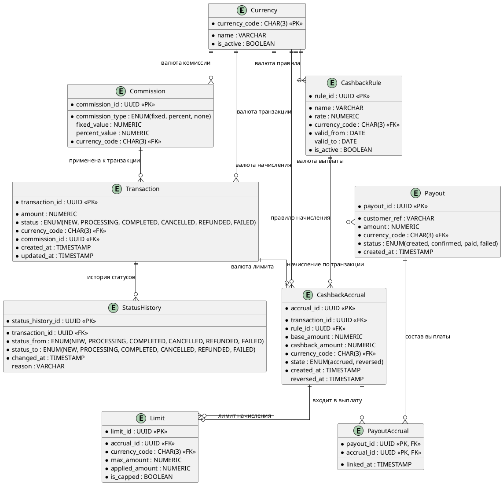
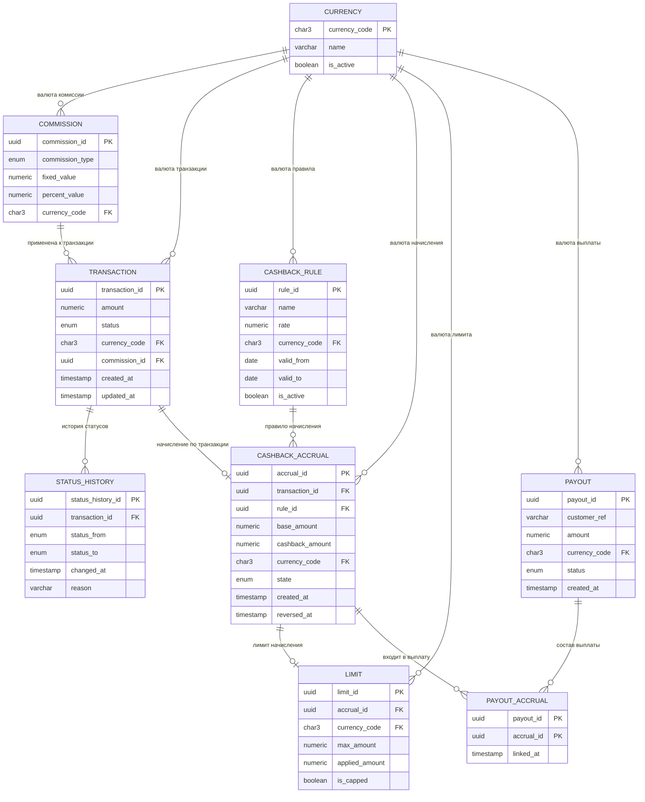

# ER-диаграмма: «Ядро начисления кэшбэка»

> **Нормализация:** 3НФ.  
> **Сущности:** `Transaction`, `CashbackRule`, `CashbackAccrual`, `Limit`, `Currency`, `Commission`, `Payout`, `StatusHistory`.  
> **Дополнительно:** `PayoutAccrual` — связующая сущность для M:N между `Payout` и `CashbackAccrual` (требуется для 3НФ, иначе сумма выплаты дублировала бы состав начислений).

---

## 1. PlantUML ER

---

## 2. Mermaid `erDiagram`

---

## 3. Пояснения по сущностям

| Сущность | Назначение | Ключ | Связи |
|---|---|---|---|
| `Currency` | Справочник валют: RUB, USD, EUR | `currency_code` | 1:N к Commission, Transaction, CashbackRule, CashbackAccrual, Limit, Payout |
| `Commission` | Тип и параметры комиссии: fixed, percent, none | `commission_id` | N:1 к Currency; 1:N к Transaction |
| `Transaction` | Транзакция клиента | `transaction_id` | N:1 к Currency, Commission; 1:N к StatusHistory; 1:0..1 к CashbackAccrual |
| `StatusHistory` | История смены статусов транзакции | `status_history_id` | N:1 к Transaction |
| `CashbackRule` | Правило начисления кэшбэка | `rule_id` | N:1 к Currency; 1:N к CashbackAccrual |
| `CashbackAccrual` | Начисление или сторно кэшбэка по транзакции | `accrual_id` | N:1 к Transaction, CashbackRule, Currency; 1:0..1 к Limit; 1:N к PayoutAccrual |
| `Limit` | Применённый лимит `500 000 RUB` | `limit_id` | N:1 к CashbackAccrual, Currency |
| `Payout` | Выплата кэшбэка клиенту | `payout_id` | N:1 к Currency; 1:N к PayoutAccrual |
| `PayoutAccrual` | Состав выплаты (M:N) | `(payout_id, accrual_id)` | N:1 к Payout, CashbackAccrual |

---

## 4. Соответствие Sequence → ER

| Участник Sequence | Сущность ER | Комментарий |
|---|---|---|
| Transaction Source | `Transaction` + `StatusHistory` | Источник события транзакции и её статусов |
| Cashback Core | — | Логика; не хранит состояние, работает с сущностями ниже |
| Commission Calculator | `Commission` | Тип комиссии и параметры |
| Currency Converter | `Currency` | Справочник валют; курсы — вне скоупа BRD |
| Limit Service | `Limit` | Применённый лимит `500 000 RUB` |
| Ledger | `CashbackAccrual` | Начисление и сторно |
| Notification | — | Уведомления; состояние не хранит |
| Reporting | `CashbackAccrual`, `Payout`, `StatusHistory` | Источники данных для отчётности |
| Payout Service | `Payout` + `PayoutAccrual` | Выплата и её состав |
| CashbackRule (BRD) | `CashbackRule` | Ставка кэшбэка задаётся продуктом |

---

## 5. Приведение к 3НФ

| НФ | Проверка | Результат |
|---|---|---|
| 1НФ | Все атрибуты атомарны; повторяющихся групп нет | ✅ |
| 2НФ | Все неключевые атрибуты зависят от полного первичного ключа; в `PayoutAccrual` ключ составной, атрибут `linked_at` зависит от полного ключа | ✅ |
| 3НФ | Транзитивных зависимостей нет: `currency_code` вынесен в `Currency`; `commission_type` вынесен в `Commission`; состав выплаты вынесен в `PayoutAccrual`; лимит вынесен в `Limit` | ✅ |

**Устранённые транзитивные зависимости:**

- Валюта транзакции/комиссии/правила/начисления/лимита/выплаты → вынесена в `Currency`.
- Тип и параметры комиссии → вынесены в `Commission`.
- Состав выплаты (какие начисления входят) → вынесен в `PayoutAccrual`.
- Применённый лимит по начислению → вынесен в `Limit`.

---

## 6. Самопроверка

- [x] Все сущности из Sequence отражены: `Transaction`, `CashbackRule`, `CashbackAccrual`, `Limit`, `Currency`, `Commission`, `Payout`, `StatusHistory`.
- [x] Дополнительно добавлена `PayoutAccrual` для устранения M:N и соответствия 3НФ.
- [x] Все валюты ограничены `RUB`, `USD`, `EUR` (в `Currency`).
- [x] Типы комиссий ограничены `fixed`, `percent`, `none` (в `Commission`).
- [x] Статусы ограничены `NEW`, `PROCESSING`, `COMPLETED`, `CANCELLED`, `REFUNDED`, `FAILED` (в `Transaction` и `StatusHistory`).
- [x] Лимит `500 000 RUB` отражён в `Limit.max_amount`.
- [x] Сторно отражено в `CashbackAccrual.state` и `CashbackAccrual.reversed_at`.
- [x] Идемпотентность обеспечена связью `Transaction 1:0..1 CashbackAccrual`.
- [x] Технические детали API/БД не раскрыты — только логическая модель данных.
