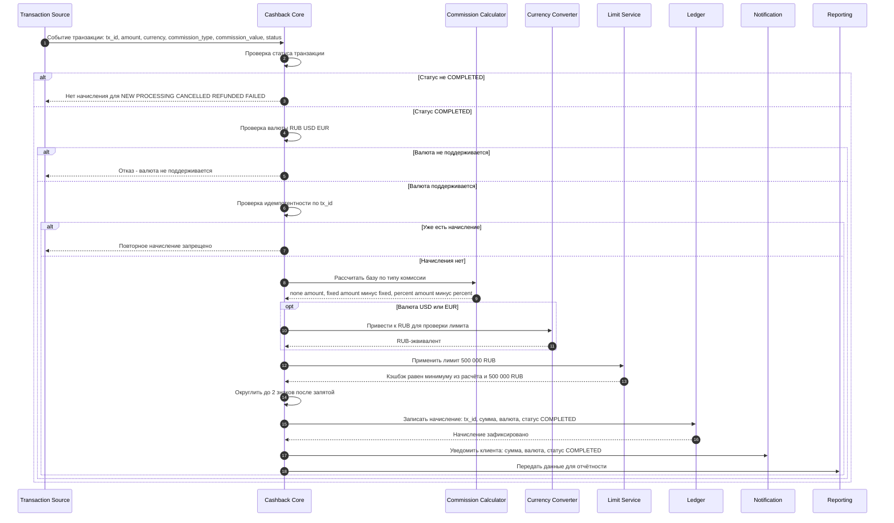
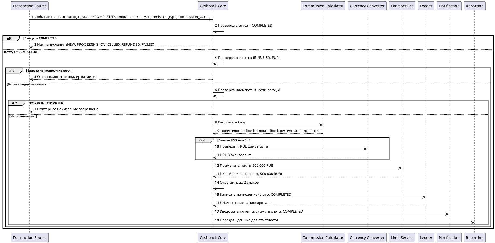
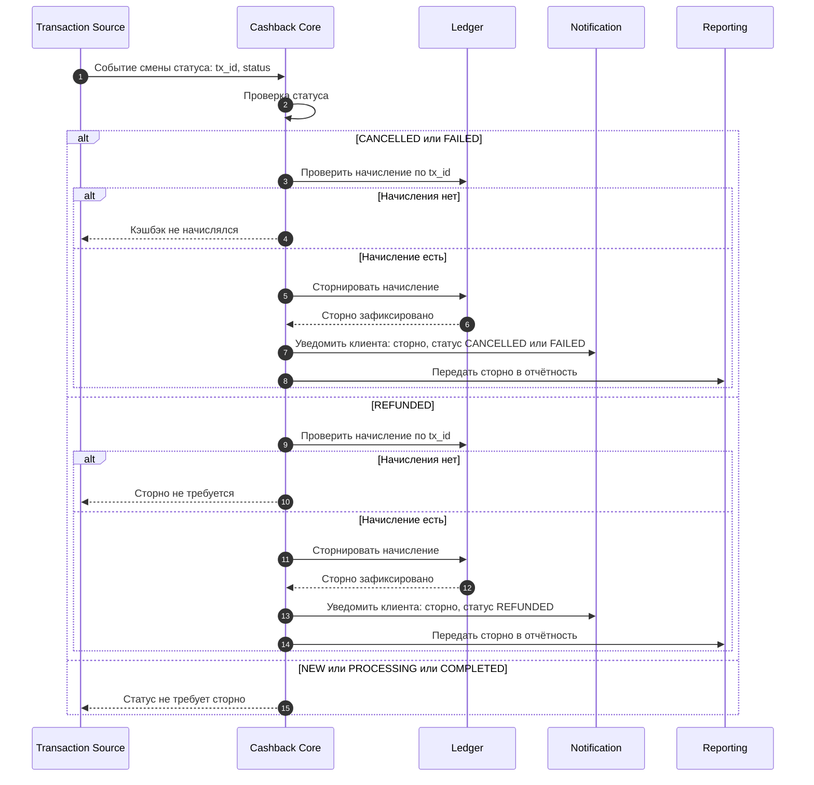
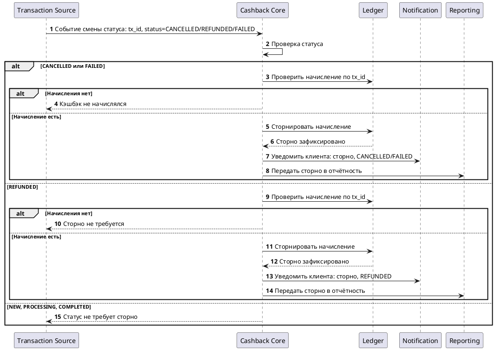
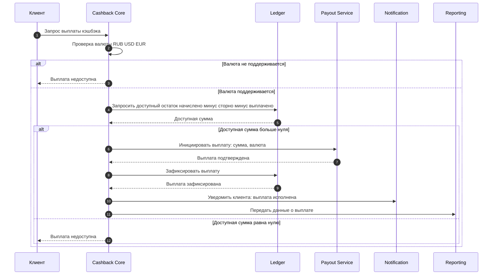
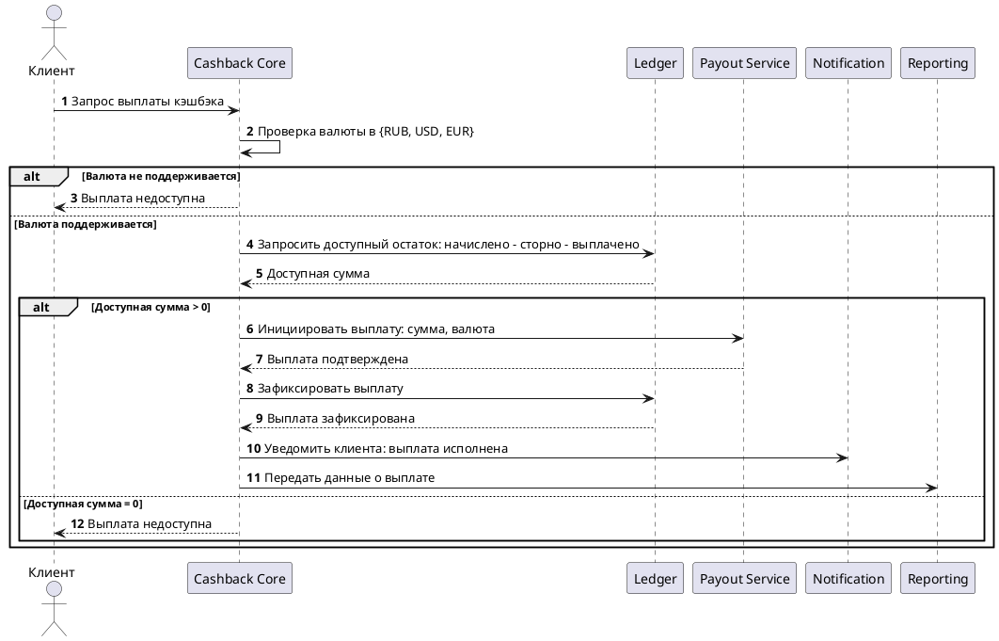

# Sequence-диаграммы: «Ядро начисления кэшбэка»

> Выплата показана как выплата доступного остатка по начисленному кэшбэку. Новые статусы транзакций не вводятся.

---

## Описание значимости артефакта

| Раздел | Содержание |
|---|---|
| Процесс и контекст использования | Системное проектирование взаимодействия компонентов ядра кэшбэка. Этап после утверждения BRD, до проектирования данных и API. |
| Цель создания | Описать последовательность вызовов и сообщений между участниками (клиент, API Gateway, сервис транзакций, ядро кэшбэка, сервис правил, сервис лимитов, БД, очередь, внешняя платёжная система) для ключевых сценариев. |
| Что становится определено | Сценарии начисления, отмены/возврата, выплаты и пересчёта; участники, порядок вызовов, предусловия, постусловия, альтернативные потоки и обработка ошибок. |
| Пользователи артефакта | Системный архитектор, системный аналитик, разработчики, QA. Используют для проектирования сервисов, определения контрактов и написания интеграционных тестов. |
| Использование в дальнейшем | Основа для ER-диаграммы и OpenAPI. Используется для трассировки шагов сценария к требованиям BRD и эндпоинтам API. |
| Последствия отсутствия | Разработчики начнут реализовывать взаимодействие по-разному, потеряются альтернативные потоки и ошибки. Возрастёт риск рассинхронизации сервисов и багов на интеграции. |

## 1. Начисление кэшбэка (`COMPLETED`)

### Mermaid

### PlantUML

---

## 2. Отмена / возврат / ошибка (`CANCELLED`, `REFUNDED`, `FAILED`)

### Mermaid

### PlantUML

---

## 3. Выплата кэшбэка

### Mermaid

### PlantUML

---

## Самопроверка

| Требование BRD | Где отражено |
|---|---|
| Валюты `RUB`, `USD`, `EUR` | Начисление, выплата: проверка валюты |
| Лимит `500 000 RUB` | Начисление: `Limit Service`, минимум из расчёта и `500 000 RUB` |
| Комиссия `none` | Начисление: база = `amount` |
| Комиссия `fixed` | Начисление: база = `amount минус fixed` |
| Комиссия `percent` | Начисление: база = `amount минус percent` |
| `NEW` | Начисление: нет начисления; отмена/возврат: сторно не требуется |
| `PROCESSING` | Начисление: нет начисления; отмена/возврат: сторно не требуется |
| `COMPLETED` | Начисление: начисляется; отмена/возврат: сторно не требуется |
| `CANCELLED` | Отмена/возврат: нет начисления или сторно |
| `REFUNDED` | Отмена/возврат: сторно ранее начисленного |
| `FAILED` | Отмена/возврат: нет начисления или сторно |
| Округление до 2 знаков | Начисление: `Округлить до 2 знаков` |
| Идемпотентность | Начисление: проверка повторного начисления по `tx_id` |
| Уведомление клиента | Начисление, отмена/возврат, выплата |
| Отчётность | Начисление, отмена/возврат, выплата |
| Статусы транзакций | Используются только `NEW`, `PROCESSING`, `COMPLETED`, `CANCELLED`, `REFUNDED`, `FAILED` |
